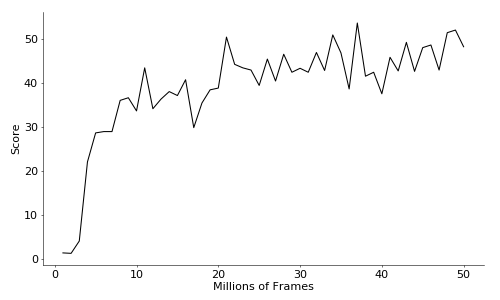

# Playing Snake with Rainbow

As the title says this is a Rainbow agent [[1]](#References) trained to play
Snake. Why Snake? Because it's a complex game from a theoretical standpoint
[[2]](#References), but at the same time quite simple to code. In the end the
agent achieves a score of around 50 on average while the maximum score possible
is 252. In total it took around a week to train the model so I don't recommend
retraining it given that the model is included if you just want to see how it
works.

 

## Installation

Clone with [git](https://git-scm.com/) and use
[conda](https://docs.conda.io/en/latest/) to create the environment.

```bash
git clone https://github.com/gheorghiuandrei/rainbow_snake.git
cd rainbow_snake
conda env create -f environment.yml
conda activate rainbow
```

## Test

This will run an infinite loop so press `Esc` when you want to close it.

```bash
python rainbow.py --test
```

## Play

If you want to play the game use the arrow keys.

```bash
python snake.py
```

## References

[1] [Rainbow: Combining Improvements in Deep Reinforcement Learning](
    https://arxiv.org/abs/1710.02298
)  
[2] [The Complexity of Snake](
    https://research.tue.nl/en/publications/the-complexity-of-snake
)